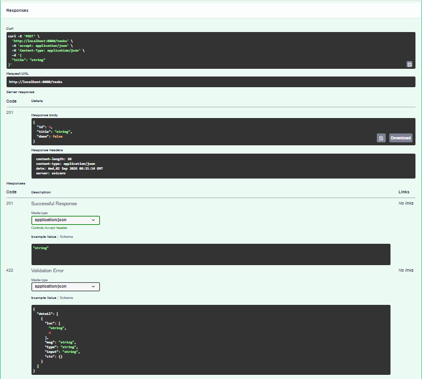

# Task API

A simple in-memory CRUD API for managing a to-do list, built with FastAPI as part of a backend learning assignment.

## What this is

This API lets you create, read, update, and delete tasks. Data is stored in memory only — it resets whenever the server restarts (there's no database yet).

## How to run it

1. Clone this repo and go into the folder:
   ```
   git clone https://github.com/ramzankhanagenticaidev/todo-api.git
   cd todo-api
   ```
2. Create a virtual environment and install dependencies:
   ```
   python -m venv venv
   venv\Scripts\activate
   pip install fastapi uvicorn
   ```
3. Start the server:
   ```
   uvicorn main:app --reload --port 8000
   ```
4. Visit `` to try it out in Swagger UI.

## Endpoints

| Method | Path            | Description                        |
|--------|-----------------|-------------------------------------|
| GET    | `/`             | API info                            |
| GET    | `/health`       | Health check                        |
| GET    | `/tasks`        | List all tasks                      |
| GET    | `/tasks/{id}`   | Get one task by id                  |
| POST   | `/tasks`        | Create a new task                   |
| PUT    | `/tasks/{id}`   | Update a task's title/done status   |
| DELETE | `/tasks/{id}`   | Delete a task                       |

## Example request

```
curl.exe -i -X POST http://localhost:8000/tasks -H "Content-Type: application/json" -d "@body.json"
```

Response:
```
HTTP/1.1 201 Created
date: Tue, 01 Sep 2026 20:56:03 GMT
server: uvicorn
content-length: 41
content-type: application/json

{"id":4,"title":"Buy bread","done":false}
```

## Swagger UI

Screenshot of a successful request/response cycle in Swagger UI:

![Swagger UI screenshot]

## Notes on in-memory storage

Restarting the server resets all tasks back to the original 3 example tasks. Anything created, updated, or deleted during a session is lost, because the data only lives in a Python list in memory — there's no database saving it to disk yet.

